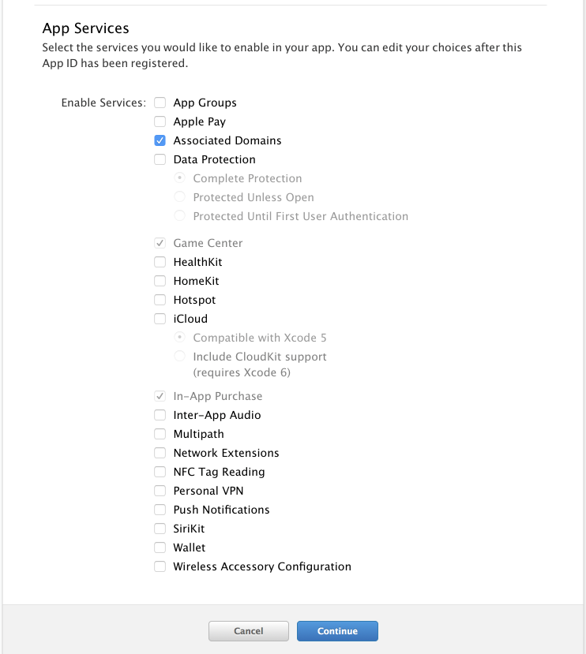
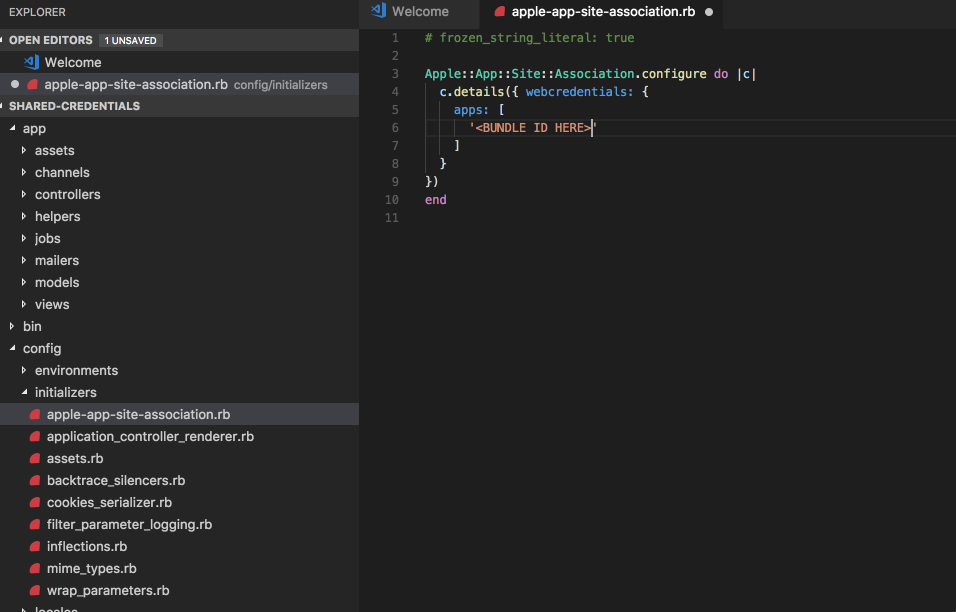
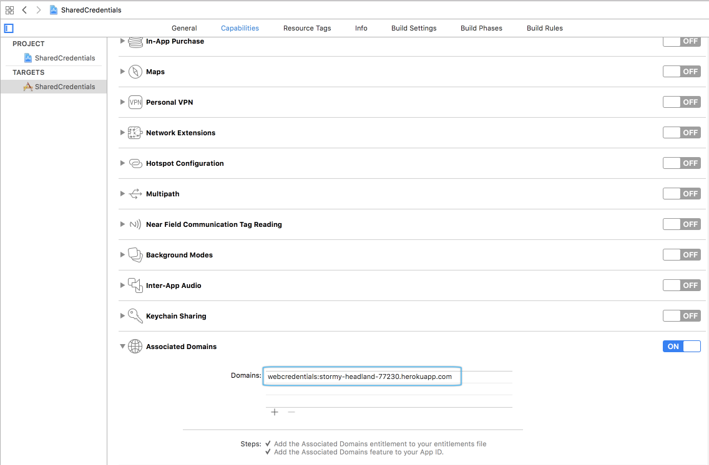
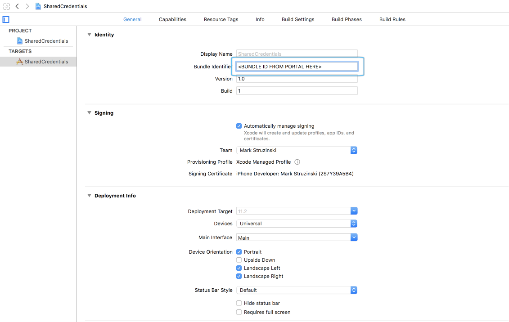

# Shared Credentials on iOS

### Approach
To demonstrate the Safari Shared Credentials properly, there are 2 components involved:

- iOS App
- Connected web app running over an SSL connection

In order to demonstrate this functionality properly, I have created a Ruby on Rails application with the ability to log in. The application will accept any combination of email and password for a login. Its sole purpose is to have Safari prompt the user to save those credentials to iCloud Keychain.  I will commit this entire web app to the repository alongside the iOS app (or to a separate repository). The proposed idea will be to deploy this app to Heroku on a free account to allow us to get an SSL connection. The Rails app has an `apple-app-site-assocation` endpoint packaged with it, which is a requirement for Shared Credentials. After the web app is in place, we can walk the user through the steps to enable Shared Credentials in the iOS app. Because this demo requires an app to be created on the [Apple developer portal](https://developer.apple.com), the user must also have an account set up there and be able to create a new iOS app.

### Steps to demonstrate this functionality:

1. Briefly explain what Shared Credentials does, and how it works
2. Explain the site association file, and the requirements for how it should be served from the web server
3. User downloads or clones the rails web app (Since the web app needs to be its own repository for Heroku deployment purposes, right now I have it committed to my personal GitHub repository [here](https://github.com/ski081/shared-credentials))
4. Walk the user through signing up for Heroku and setting up the Heroku CLI
5. Push the rails app up to Heroku and ensure it is running
6. Create the Xcode project, and walk the user through setting up Shared Credentials via the Capabilities tab under Associated Domains section
7. Walk the user through the code involved to request shared credentials from iCloud Keychain
8. Replace the site url constant in the `LoginViewController` with the one obtained during the demo
9. Start the simulator 
10. Open Settings in the simulator and ensure Autofill is on in the Safari settings
11. In the app, tap the Open Website bar button to launch the site. Enter an email and password, and accept the prompt that asks you to store the credentials
12. Relaunch the iOS app. On `viewDidAppear:`, the app should prompt to use the credentials from the web session you just used. Those credentials should prefill in the UserName and password fields. I have a delay programmed in to simulate an API request, after which some fake user data should fade at the bottom.

### Detailed Sample Walkthrough
##### Web App Setup
1. Clone the web app repository from https://github.com/ski081/shared-credentials
2. [Sign up](https://signup.heroku.com/login) or [Log In](https://id.heroku.com/login) at Heroku
3. Set up the [Heroku CLI](https://devcenter.heroku.com/articles/heroku-cli)
4. Change directories into the base folder of the web app that was just cloned
5. From the command line:
    1. `heroku login`
    2. `heroku create`
    3. `git push heroku master`
6. Verify the newly generated url is reachable from Safari

##### Dev Portal Setup
1. Go to the developer portal and create a new iOS app. 
2. After saving the newly created app, enable the Associated Domains capability

3. Copy the bundle id of the new app (along with the Team Identifier prefix)

#### Updating the Site Association File
1. Go back to the web app on local disk
2. Open Config => initializers => apple-app-site-association.rb
3. Update the `apps` array to use the team prefix and bundle id copied from the dev portal

4. Commit this change, and push again to the heroku remote

#### iOS App Setup
1. Go to the app target settings, and open the Capabilities tab
2. Enable the Associated Domains capability
3. Click the `+` button, and enter `webcredentials:<heroku domain>` from the previous steps. Make sure you don't include the `https://` in this value

4. Open the General tab in target settings, and set the bundle id to the one created on the portal

5. Open `LoginViewController`, and update the static site URL at the top of the file to the newly created site
6. Walk through the existing code to explain how the web credentials are pulled from iOS in the `attemptLoginFromSharedCredentials()` function

#### Demo
1. Run the iOS app
2. In the simulator, open Settings => Safari => Autofill, and ensure Autofill is enabled
3. Go back to the iOS app
4. Tap the Open Website button
5. Enter any email and password combination
6. Accept the prompt to store the credentials you just entered
7. Restart the iOS app
8. Tap the Request Login with Shared Credentials button 
9. A prompt should appear with the credentials that were just entered. After accepting, they should pre-fill into the username and password fields, and a simulated login will run
10. Make note that this action would normally run automatically on a login screen, but since this is a single view app, we needed a way to trigger it manually.

##### Notes
- Apple recommends storing credentials in the local device keychain after retrieving them from shared credentials. They say to not use Shared Credentials as your system of record. To avoid additional complexity, I didn't include this step, but we should at least mention it.
- Ideally, login would happen transparently up until the Shared Credentials prompt, but because this was a single view app and I needed a way to trigger the prompt manually after storing the credentials, I included a button at the top of the view to initiate everything
- The Login button at the bottom of the view is completely for demo purposes to show a standard login screen and to display proper state

---------
#### Reference
- https://developer.apple.com/documentation/security/shared_web_credentials
- https://developer.apple.com/documentation/security/shared_web_credentials/preparing_your_app_and_website_to_share
- https://developer.apple.com/documentation/security/shared_web_credentials/managing_shared_credentials
